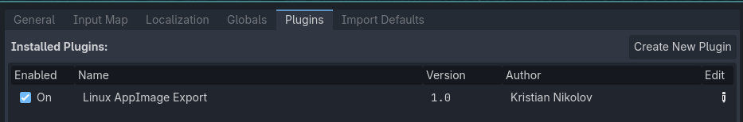
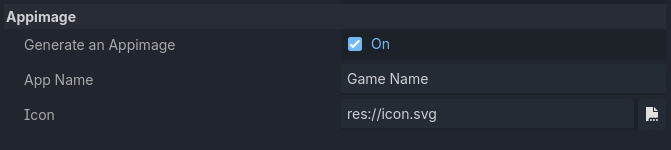

# Linux AppImage Export Godot Addon

This is a Godot 4 export plugin for exporting a game as a Linux AppImage.

## Prerequisites
- A Linux device
- [appimagetool](https://github.com/AppImage/appimagetool/releases) installed into `.local/bin` or `/usr/bin` with the name `appimagetool`

## How to use
1. Make sure the plugin is installed and enabled

2. Create a linux preset and fill the AppImage information

3. Export
